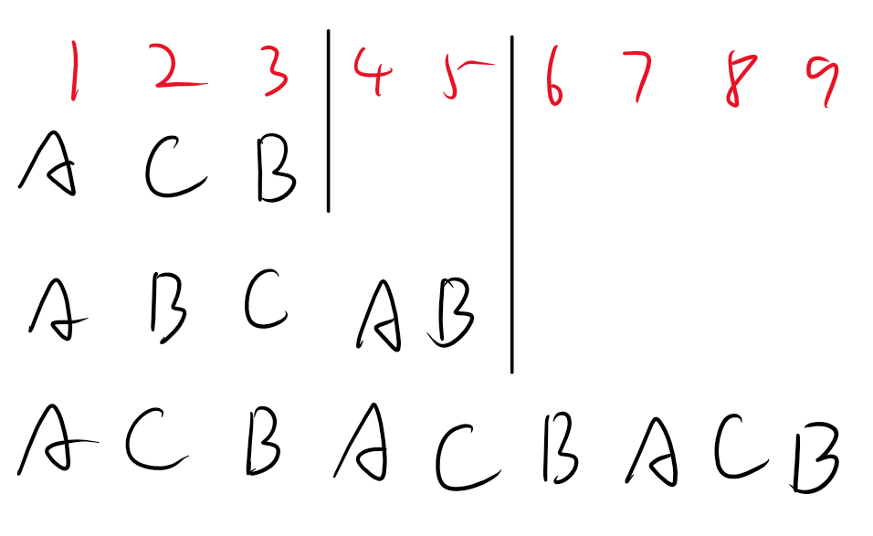
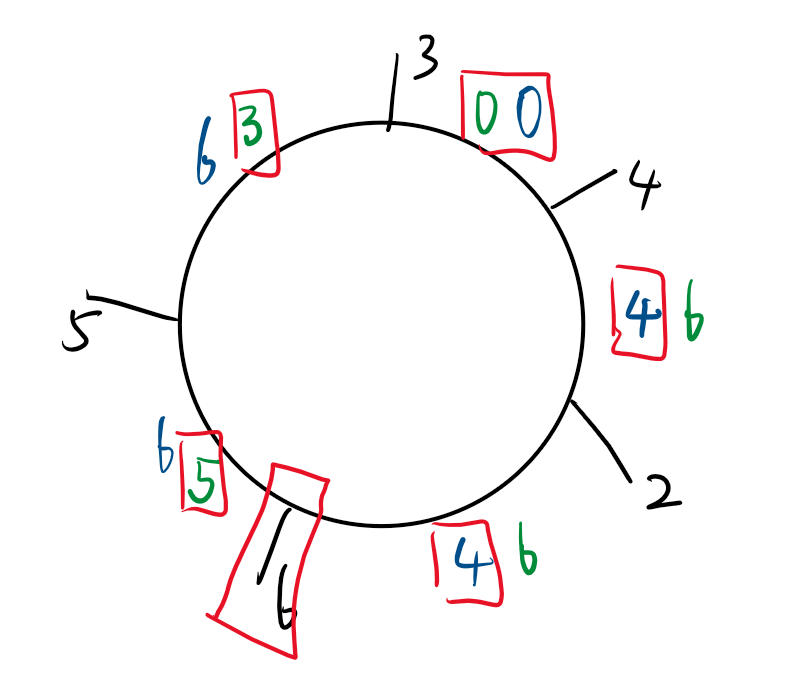

*赛时ABC三题，D题畏惧了，没有看，实际上非常简单，F题需要一个特殊处理*


A题是简单的排序判断
B题是枚举12**剩余类**，其中只有余数10不是回文数，因此10没有答案，大于10且余数为10的为22，是回文数，因此直接取1,2,3,4,5,6,7,8,9,22,11作为回文数即可。
如果实在没想到，不妨试试**打表**，很容易观察出来
<del>PS：我就是打表发现的。。。</del>


## D

给你一个整数 $k$ 。有一个 $n$ \位二进制数 $a_1, a_2, \ldots, a_{2^k + 1}$ 的序列。号码 $a_1$ 和 $a_{2^k + 1}$ 是给你的，其他号码未知。然后通过 $k$ 步骤如下填写未知数字：

- 假设在第 $i$ 步之前，索引为 $p_1 \lt p_2 \lt \ldots \lt p_m$ 的数字已经被填充。 （在第一步之前，这些是索引为 $1, 2^{k} + 1$ 的数字）。
- 然后，对于从 $1$ 到 $m - 1$ 的每个 $j$ ，执行分配 $a_{\frac{p_j + p_{j + 1}}{2}} := a_{p_j} \oplus a_{p_{j + 1}}$ $^{\text{∗}}$ 。
- 这些分配同时发生，之后所有这些数字也都被填满。

可以证明这个过程总是完全填满所有数字。

$k = 2$ 和 $n = 3$ 的流程如下所示，其中最初为 $a_1 = \texttt{010}, a_5 = \texttt{110}$ ：

- 在第一步之前，填充索引为 $1, 5$ 的数字。因此，该操作将执行 $a_3 := a_1 \oplus a_5 = \texttt{010} \oplus \texttt{110} = \texttt{100}$ 。
- 在第二步之前，填充索引为 $1, 3, 5$ 的数字。因此，此操作将执行 $a_2 := a_1 \oplus a_3 = \texttt{110}$ 和 $a_4 = a_{3} \oplus a_{5} = \texttt{010}$

您需要计算以下表达式： $x_1 \cdot y_1 + x_2 \cdot y_2 + \ldots + x_{2^k + 1} \cdot y_{2^k + 1}$ ，其中 $x_i$ 是第 $i$ 个数字中的设置位数， $y_i$ 是第 $i$ 个数字中的零位数。

$^{\text{∗}}$ $x \oplus y$ 表示数字 $x$ 和 $y$ 的按位异或



#### 分析：
$2^k+1$个长度为n的二进制数，只给你第一个数A和最后一个数B，通过一定的填鸭方式填满序列，每个数的对答案的贡献是 1的数量$\times$0的数量。
填鸭方式就是两端取异或$\oplus$得到中间的值，实际上最终只有三种数ABC，其中$C=A\oplus B$。
因为异或的性质，使得$A\oplus C=B$，$B\oplus C=A$。经过一几个数的推导（实际上是对称性），我们合理猜测A和B的数量一致，C的数量在不超过AB的情况下尽量大。因此得出
$$sum_C=\lfloor\frac{2^k+1}{3}\rfloor$$

$$sum_A=sum_B=\frac{2^k+1-sum_C}{2}$$



**Code**
```cpp
void sol()
{
    int n,k,a=0,b=0,c=0;
    string s1,s2;
    cin>>n>>k;
    cin>>s1>>s2;
    for(int i=0;i<n;i++)
    {
        if(s1[i]=='1')a++;
        if(s2[i]=='1')b++;
        if(s1[i]!=s2[i])c++;
    }
    a=a*(n-a);
    b=b*(n-b);
    c=c*(n-c);
    int sum=(1<<k)+1,ans=0;
    int sa,sb,sc;
    sc=sum/3;
    sa=sb=(sum-sc)/2;
    ans=a*sa+b*sb+c*sc;
    cout<<ans<<'\n';
}
```

## C/F

### 题面
有 $n$ 无限高的连通器排列成一圈。每个容器的底面积为 $1$ cm $^2$ ，并且在第 $i$ 个容器和第 $(i \bmod n) + 1$ 个容器之间在高度 $h_i$ cm处存在可忽略不计的体积的连接。对于每个容器 $i$ ，求在第 $i$ 个容器保持空的情况下可以放入这些容器中的最大总水体积（以cm $^3$ 为单位）。

正式地，您将获得一个数组 $h_1, h_2, \ldots, h_n$ 。如果满足以下条件，则非负整数的循环数组 $w_1, w_2, \ldots, w_n$ 被称为良好：

- 对于从 $1$ 到 $n$ 的每个 $i$ ，如果是 $\max(w_i, w_{i \bmod n + 1}) \gt h_i$ ，则为 $w_i = w_{i \bmod n + 1}$ 。换句话说，如果数组 $w$ 的两个相邻元素的最大值超过了数组 $h$ 的相应元素，则数组 $w$ 的这两个相邻元素必须相等。

对于从 $1$ 到 $n$ 的每个 $i$ ，在 $w_i = 0$ 的条件下，输出所有好数组 $w_1, w_2, \ldots, w_n$ 中的最大可能总和 $w_1 + w_2 + \ldots + w_n$ 。



#### 分析：
需要在保证i桶为空的情况下，求最多能加多少水。

**easy version**
可以接受$O(N^2)$处理，因此我们对于每一个i，顺时针和逆时针处理数据。
以顺时针为例，我们贪心地能加多少加多少，保证**不会让身后的桶水量增加**即可（**不保证不影响前方**），例如考虑第一个桶，序列h={3,4,2,6,1,5}，我们顺时针看（正向），得到的的序列为{0,4,4,6,6,6}，实际上就是转化为一个**单调不减序列**。逆时针同理。
我们得到两个序列$A$和$B$对应顺时针和逆时针的单调不减序列，对于每一个位置，取两者的最小值就是最优情况。（因为最小值同时不会向左或右影响，且是贪心的最大值）


*图中蓝色为顺时针的A序列，绿色为逆时针的B序列，红色圈出的为选择情况*

**hard version**
通过上面的分析，我们假设最大的通道高度为$H$，对于两个贪心序列A和B，经过该位置时，后续的值全为$H$，因此我们取了最小值之后，对于位置i，其最终答案为在顺时针方向，选择了A序列到H的部分，以及逆时针防线，选择了B序列到H的部分。
如果我们**从H处断开**，展开成一条链，那么就是一段单调不减的后缀和一段单调不增的前缀。
因此我们预处理出来即可。


**Code**
```cpp
//easy version
int F(int x)
{
    int res=0,cnt=n;
    vector<int>th(n,0),cur(n,0),h1(n,0),h2(n,0);
    while(cnt--)
    {
        int ii=(x+n)%n;
        th[n-cnt-1]=h[ii];
        x++;
    }
    int minh=0;
    for(int i=1;i<n;i++)
    {
        h1[i]=max(th[i-1],minh);
        minh=h1[i];
    }
    minh=0;
    for(int i=n-1;i>0;i--)
    {
        h2[i]=max(th[i],minh);
        minh=h2[i];
    }
    for(int i=1;i<n;i++)
    {
        cur[i]=min(h1[i],h2[i]);
    }
    for(auto i:cur)res+=i;
    return res;
}

void sol()
{
    cin>>n;
    for(int i=0;i<n;i++)cin>>h[i];
    for(int i=0;i<n;i++)
    {
        cout<<F(i)<<' ';
    }
    cout<<'\n';
}

//hard version
void sol()
{
    int n;
    cin>>n;
    vector<int>a(n+1,0),h(n+1,0);
    int maxh=0,maxi=0;
    for(auto i=1;i<=n;i++)
    {
        cin>>a[i];
        if(a[i]>maxh)
        {
            maxh=a[i];
            maxi=i;
        }
    }
    for(int i=maxi+1,j=1;i<=maxi+n;i++,j++)
    {
        int t=(i+n-1)%n+1;
        h[j]=a[t];
    }
    vector<int>stk1(n+1,0),stk2(n+1,0);
    vector<int>pre(n+1,0),suf(n+1,0);
    int cnt1=0,cnt2=0,sum=0;
    for(int i=1;i<n;i++)
    {
        while(cnt1&&h[stk1[cnt1]]<h[i])
        {
            int x=h[stk1[cnt1]],k=stk1[cnt1]-stk1[cnt1-1];
            cnt1--;
            sum-=x*k;
        }
        int x=h[i],k=i-stk1[cnt1];
        stk1[++cnt1]=i;
        sum+=x*k;
        pre[i]=sum;
    }
    sum=0;
    stk2[0]=n;
    for(int i=n-1;i;i--)
    {
        while(cnt2&&h[stk2[cnt2]]<h[i])
        {
            int x=h[stk2[cnt2]],k=-stk2[cnt2]+stk2[cnt2-1];
            cnt2--;
            sum-=x*k;
        }
        int x=h[i],k=stk2[cnt2]-i;
        stk2[++cnt2]=i;
        sum+=x*k;
        suf[i]=sum;
    }
    for(int i=1;i<=n;i++)cout<<pre[(i+n-2-maxi)%n+1]+suf[(i-maxi+n-1)%n+1]<<" \n"[i==n];
}
```
